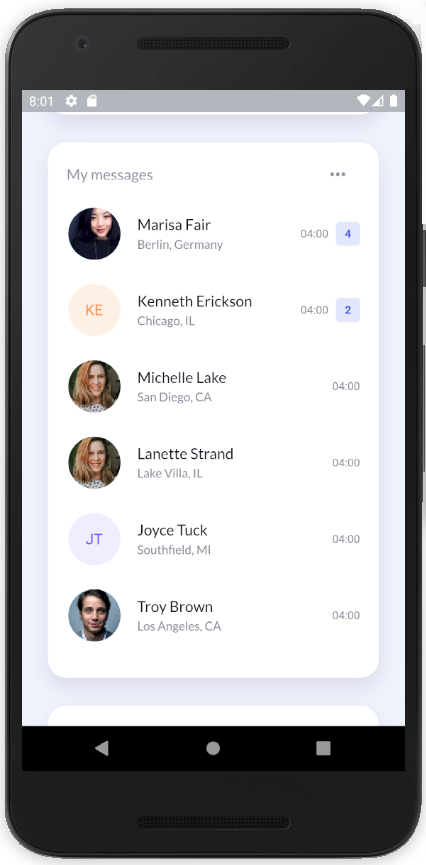
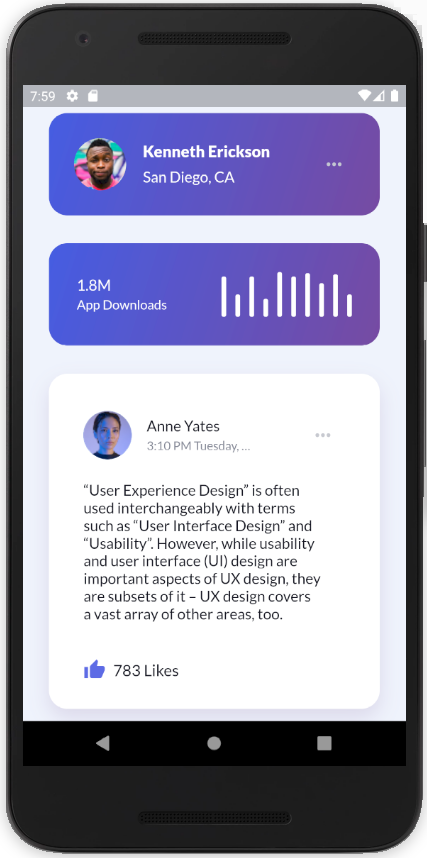
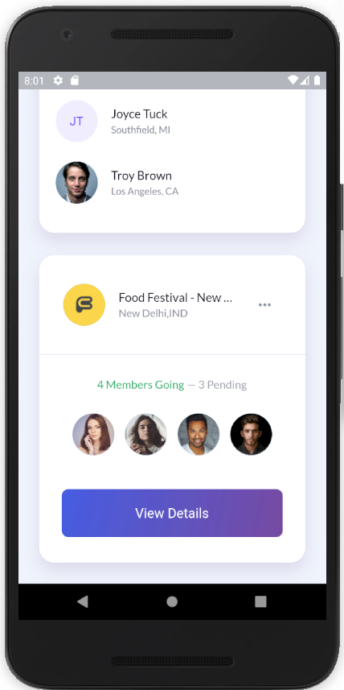

# Flutter Experiments

This app will be a simple hub containing different design developed by me in Flutter. Just open it and play around with the different experiments available.

## Cards UI

Cards UI is a design that I found in dribbble (https://dribbble.com/shots/8202116-Cards-Free-UI-Kit-Freebie). I really liked it and therefore I tried to port it to Flutter as a static app to show its flexibility.

Here you can see some screenshots of the result:

  
   
  

